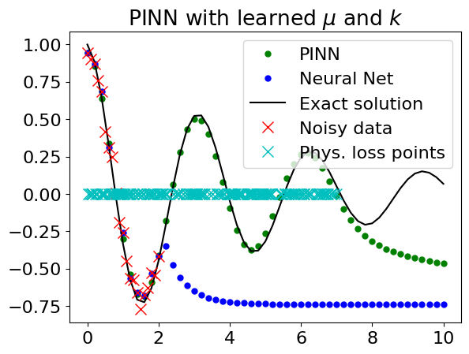

# Introduction to physics informed neural networks (PINNs)

This repo contains material for a two-hour workshop for introducing PINNs. The contents include a presentation, a coding exercise and solutions notebook inteded to introduce PINNs. The presentation is aimed at an audience with a general data science background. The coding example provides a guide on how to create a physics informed neural network from scratch, using synthetic data from a dampened harmonic oscillator system. 

In the coding exercise, we learn a dampened mass-spring system with unit mass, dampening coefficient $\mu$ and spring constant $k$. Using PINNs and from just 20 noisy data points, we can learn the parameters $\mu$ and $k$ to within 5% accuracy. 

| | Dampened harmonic oscillations| 
|-----------|:----------:|
| **Model ODE**  | $\ddot{x} + \mu \dot{x} + kx = 0$ |
| **True ODE**  | $\ddot{x} + 0.4 \dot{x} + 4x = 0$ |
| **Learned ODE**  | $\ddot{x} + 0.3986 \dot{x} + 4.190x = 0$|
| | |

The results are displayed in the below figure.

Experiment with the notebook, by changing the hyperparameters, and see how much you can improve the accuracy! 